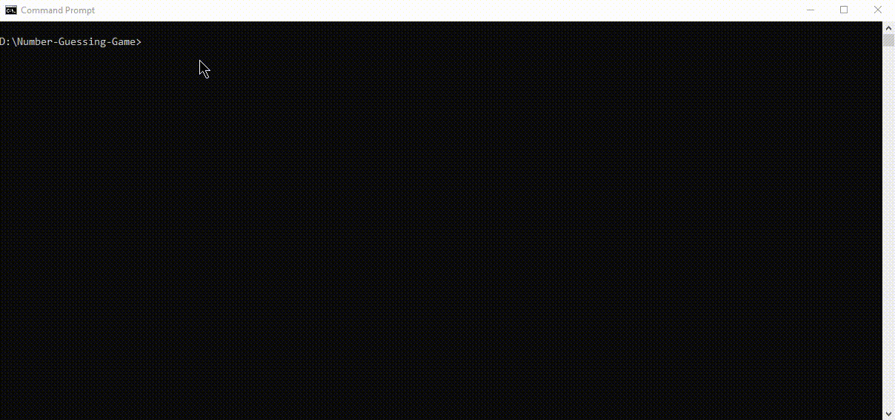

# Number Guessing Game 🎲

## https://roadmap.sh/projects/number-guessing-game
## Description
The repository "Number Guessing Game" implements a simple number guessing game where the player tries to guess a randomly generated number between 1 and 100.

---

## Features
- Different difficulty levels (Easy, Medium, Hard) with a varying number of attempts.
- User input to guess the number and receive feedback on whether the guess is too high or too low.
- Option to play again after each game.

---

## Prerequisites
Before you begin, make sure you have the following installed:
- Python 3+
---

## Installation
Follow these steps to set up the project locally:

  1. Clone the repository:
     ```bash
     git clone https://github.com/ibrahim-sisar/Number-Guessing-Game.git
     ```
  2. Navigate to the project directory:
      ```bash
      cd Number-Guessing-Game
      ```
  3. Run code:
     ```bash
     python main.py
     ```
## Usage
  
  
## Technologies Used
  - python
  - random lib

## Contributing
  #### Contributions are welcome! Please follow these steps:
   1. Fork the repository.
   2. Create a new branch:
      ```bash
        git checkout -b feature-name
      ```
   3. Commit your changes:
      ```bash
      git commit -m "Add your message here"
      ```
   4. Push to the branch:
      ```bash
      git push origin feature-name
      ```
   5. Open a pull request.

## License
   This project is licensed under the MIT License - see the [LICENSE](LICENSE) file for details.

  
